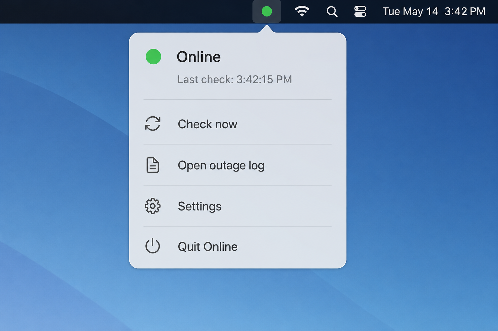
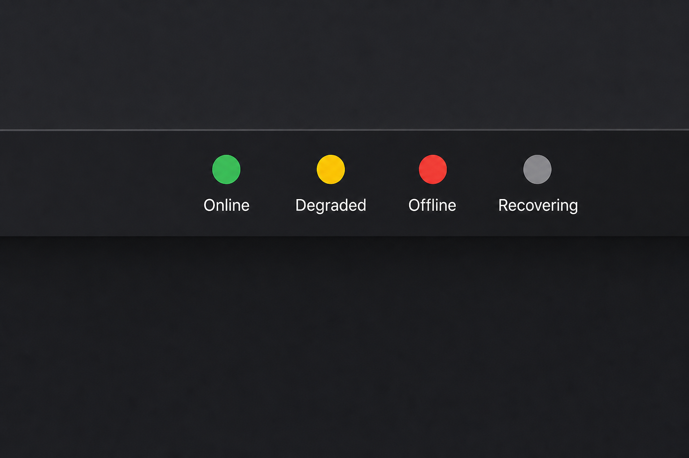

# Foghorn

[](https://github.com/Jubblin/Foghorn/actions/workflows/ci.yml) [](LICENSE) [](https://www.apple.com/macos/) [](https://swift.org)

**The truth about your connection.**

macOS can show Wi‑Fi as connected while pages fail to load — router issues, ISP outages, captive portals, and DNS failures all leave the system indicator green. Foghorn probes your network in layers and only surfaces an alert when something is actually wrong. Silent in clear weather. Impossible to miss in the fog.

**Docs site:** [jubblin.github.io/Foghorn](https://jubblin.github.io/Foghorn/) (same guides as this repo).

## Why Foghorn?

| macOS indicator          | Foghorn                                       |
| ------------------------ | ---------------------------------------------- |
| Link up (Wi‑Fi/Ethernet) | Layered reachability probes                    |
| No failure attribution   | Router, DNS, ISP, captive portal, custom host  |
| Silent failures          | Notification on confirmed outage + restore     |
| No history                | JSON outage log with timestamps                |

**Alert-first by design** — the opposite of menu bar clutter. You forget it exists until your VPN dies mid-call and macOS never told you.

## Features

- **Layered Sentinel probes** — `NWPathMonitor`, gateway via `NWPath.gateways` (TCP fallback), DNS lookup, HTTP HEAD (`captive.apple.com` + `cloudflare.com`), optional custom hosts
- **Smart debouncing** — 15s evaluation window, 15s wake-from-sleep grace, 2-tick recovery confirmation, 3-tick rapid outage detection
- **Failure attribution** — know whether it's your router, DNS, ISP, captive portal, or a custom endpoint
- **Outage log viewer** — sortable in-app table; copy JSON or open file in Finder
- **Menu bar visibility** — hide the icon in Settings; monitoring and alerts continue
- **Battery-aware** — longer poll intervals on battery power
- **Launch at login** — via `SMAppService`
- **Automatic updates** — signed Sparkle appcast, with an optional pre-release channel
- **Native Swift/SwiftUI** — macOS 14+, no Electron, one dependency (Sparkle, for updates)

## Screenshots

**Healthy — menu bar popover**



**Traffic-light states** — green (online), yellow (degraded), red (offline), gray (recovering)



## Install

### From GitHub Releases (recommended)

1. Download the DMG for your Mac from [Releases](https://github.com/Jubblin/Foghorn/releases):
   - Apple Silicon: `Foghorn-<version>-arm64.dmg`
   - Intel: `Foghorn-<version>-amd64.dmg`
2. Open the DMG and drag **Foghorn** onto **Applications**
3. Launch Foghorn and grant notification permission when prompted

**Signing status:** Released DMGs are Developer ID signed and notarized, and open normally. Builds you make yourself with `build-dmg.sh` are unsigned, and Apple Silicon Gatekeeper may show:
> "Foghorn" is damaged and can't be opened. You should move it to the Bin.

Right-click → Open does **not** fix that for unsigned downloads. Clear quarantine after install (local workaround only):

```
xattr -cr /Applications/Foghorn.app
```

Then launch Foghorn again, or build with `build-signed-dmg.sh` if you have a Developer ID certificate. Details: [docs/RELEASE.md](docs/RELEASE.md#unsigned-dmgs-and-gatekeeper).

### Build from source

**Requirements:** macOS 14 Sonoma or later, Xcode 15+

```
git clone https://github.com/Jubblin/Foghorn.git
cd Foghorn
open Foghorn.xcodeproj
```

Or from the command line:

```
xcodebuild -project Foghorn.xcodeproj -scheme Foghorn -configuration Release build
# App: build/Build/Products/Release/Foghorn.app

chmod +x scripts/build-dmg.sh
./scripts/build-dmg.sh Release arm64   # or amd64
# DMG: build/Foghorn-<version>-arm64.dmg
```

## Usage

1. **Foghorn** appears in the menu bar (subtle when healthy)
2. Click the icon for the current status and last probe time. The popover stays quiet when
   nothing is wrong: probe rows retire five minutes after the connection settles, and a
   recovered outage drops off an hour after it ends. Both come straight back when something
   fails.
3. Open **Settings** from the popover to configure:
   - **Interrupt** — show in menu bar, appearance, notification permission status
   - **Checks** — poll interval (2s, 5s, 10s, 30s; doubles on battery, capped at 8s) and custom
     hosts probed via HTTPS HEAD
   - **Remembers** — launch at login, and update behaviour including the pre-release channel
   - **Help** — privacy and support links, version and build, and the outage log
4. **View outage log…** in Settings → Help for the full history in a table

If you hide the menu bar icon, Settings is no longer reachable from it — Foghorn runs as an
accessory app with no app menu. Reopen it with:

```
open -a Foghorn --args -open-settings
```

Notifications fire on **confirmed outage** and when connectivity **restores**.

## How it works

```
ProbeEngine (2s tick, battery backoff)
  ├── PathProbe        NWPathMonitor — interface up?
  ├── GatewayProbe     SCDynamicStore + NWPath.gateways (TCP fallback)
  ├── DNSProbe         Resolve cloudflare.com
  ├── HTTPProbe        HEAD captive.apple.com + cloudflare.com
  └── CustomHostProbe  User-defined hosts

ConnectivityStateMachine
  ├── 15s evaluation window
  ├── 15s wake grace (suppress sleep/wake blips)
  └── States: Healthy → Degraded → Outage → Recovering

Outputs
  ├── NSStatusItem popover (alert-first)
  ├── UserNotifications
  └── OutageLog (JSON on disk)
```

### Connectivity states

The menu bar icon is always a filled dot; the colour carries the meaning.

| State      | Menu bar   | Alerts       |
| ---------- | ---------- | ------------ |
| Healthy    | Green dot  | None         |
| Degraded   | Amber dot  | None         |
| Outage     | Red dot    | Notification |
| Recovering | Gray dot   | None         |

## Development

```
# Run the full local health stack (lint, shellcheck, build, test)
chmod +x scripts/health.sh
./scripts/health.sh

# Or run unit tests only
xcodebuild test \
  -project Foghorn.xcodeproj \
  -scheme Foghorn \
  -configuration Debug \
  -destination 'platform=macOS'

# Bump version locally (CI does this on PRs)
./scripts/bump-version.sh patch
```

See [CONTRIBUTING.md](CONTRIBUTING.md) for PR workflow, version labels, and code guidelines.

### Project structure

```
Foghorn/
  Probes/     PathProbe, GatewayProbe, DNSProbe, HTTPProbe, ProbeEngine
  State/      ConnectivityStateMachine
  Services/   AlertService, OutageLog, WakeObserver, LaunchAtLoginService,
              StatusItemController (menu bar + popover), AppUpdateService (Sparkle)
  Models/     ProbeResult, ConnectivityState, OutageRecord, AppSettings
  Views/      MenuBarView, SettingsView, SettingsChrome, OutageLogView
FoghornTests/   State machine, outage record, snapshot, HTTP mock tests
FoghornUITests/ Settings and popover smoke tests
scripts/      build-dmg.sh, build-signed-dmg.sh, resolve-release-arch.sh, bump-version.sh,
              health.sh, test-scripts.sh (tests the release scripts)
```

## CI / Release

| Workflow          | Trigger             | What it does                          |
| ------------------ | -------------------- | -------------------------------------- |
| [CI](.github/workflows/ci.yml)                             | Push to `main`, PRs | Lint, script tests, docs sync, unit + UI tests; Release build on `main` |
| [Release dispatch](.github/workflows/release-dispatch.yml) | Manual              | Finalize CHANGELOG + tag `v*`         |
| [Release](.github/workflows/release.yml)                   | Tag `v*`            | Signed/notarized DMG → GitHub Release |
| [Release Store](.github/workflows/release-store.yml)       | Tag `v*` or manual  | Upload to TestFlight                  |
| [Version bump](.github/workflows/version-bump.yml)         | PR to `main`        | Auto-bump semver + build number       |

**Cut a release:** Actions → **Release dispatch** on `main`, or see [docs/RELEASE.md](docs/RELEASE.md).

**PR version labels:** `version:patch` (default), `version:minor`, `version:major`

[Renovate](https://github.com/apps/renovate) keeps GitHub Actions up to date ([`renovate.json`](renovate.json)).

## Signing

CI can produce Developer ID signed and notarized DMGs when [signing secrets](docs/RELEASE.md#ci-signing-secrets) are configured. For local distribution:

```
./scripts/build-signed-dmg.sh Release arm64   # requires DEVELOPMENT_TEAM + cert in keychain
./scripts/build-signed-dmg.sh Release amd64
# or unsigned:
./scripts/build-dmg.sh Release arm64
./scripts/build-dmg.sh Release amd64
```

Unsigned CI/local builds need the [`xattr -cr` workaround](#install) on Apple Silicon if Gatekeeper reports the app as damaged.

## Roadmap

All items from the initial roadmap are shipped. Future work is tracked in [open issues](https://github.com/Jubblin/Foghorn/issues); [TODOS.md](TODOS.md) keeps the shipped history.

## Related projects

- [Online Check](https://onmymenubar.app/online-check/) by Sindre Sorhus — alert-first HEAD probes (inspiration)
- [Pulse](https://github.com/altuzar/pulse-app) — Swift menu bar network monitor (MIT)

## Contributing

Contributions welcome. Please read [CONTRIBUTING.md](CONTRIBUTING.md) and [CODE_OF_CONDUCT.md](CODE_OF_CONDUCT.md).

- [Report a bug](.github/ISSUE_TEMPLATE/bug_report.yml)
- [Request a feature](.github/ISSUE_TEMPLATE/feature_request.yml)
- [Security policy](SECURITY.md)

## Changelog

See [CHANGELOG.md](CHANGELOG.md).

## License

[MIT](LICENSE) © 2026 [Jubblin](https://github.com/Jubblin)

*Foghorn was formerly named Online.*
